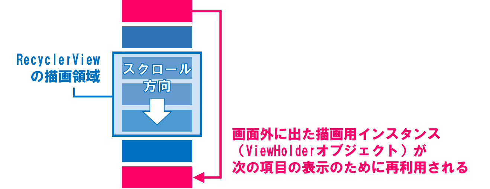
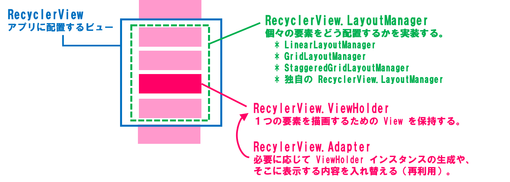
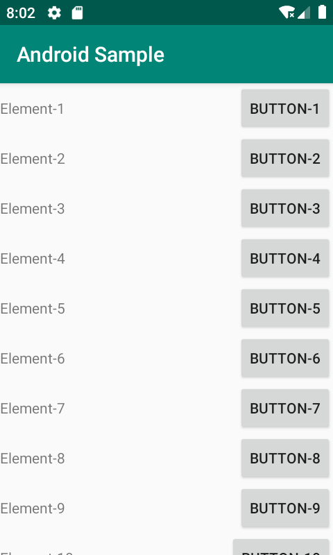

RecyclerView とは
----

Android アプリで多数のコンテンツのリストを表示したいケースでは、[RecyclerView](https://developer.android.com/reference/kotlin/androidx/recyclerview/widget/RecyclerView.html) という UI コンポーネントを使用すると、個々のアイテムの描画用インスタンスを使いまわしながら効率的な描画を行えます。
`RecyclerView` によって表示された描画領域をスクロールし、表示されているコンテンツが画面外に消えていくと、その描画用インスタンスが、新たに画面内に入ってきたコンテンツのために使いまわされます。

{: .center }

このとき使いまわされる描画用インスタンスを、view holder オブジェクトといい、[RecyclerView.ViewHolder](https://developer.android.com/reference/kotlin/androidx/recyclerview/widget/RecyclerView.ViewHolder.html) を継承して、任意の View を保持するように実装します。

`ListView` などでも複数のコンテンツを並べることはできますが、`ListView` は一度にすべてのコンテンツを表示しきってしまえるような場合に使用します。
何十、何百というコンテンツを並べたいときは、`RecyclerView` を使用します。


RecyclerView の構成
----

{: .center }

RecyclerView はこのような構成要素から成り立っています。

RecyclerView
: Android アプリ上に表示する View コンポーネントです。

RecyclerView.LayoutManager
: `RecyclerView` 上の各要素をどのように配置するかのアルゴリズムを実装します。標準のレイアウトマネージャーとして、[LinearLayoutManager](https://developer.android.com/reference/kotlin/androidx/recyclerview/widget/LinearLayoutManager.html) や [GridLayoutManager](https://developer.android.com/reference/kotlin/androidx/recyclerview/widget/GridLayoutManager.html) が用意されていますが、[LayoutManager](https://developer.android.com/reference/kotlin/androidx/recyclerview/widget/RecyclerView.LayoutManager.html) を拡張して独自のレイアウトマネージャーを作成することもできます。

RecyclerView.ViewHolder
: `RecyclerView` 上の各要素を描画するための `View` を保持します。この `ViewHolder` インスタンスは、画面外にスクロールアウトしたときに、別の項目を表示するために再利用されます。

RecyclerView.Adapter
: `RecyclerView` と実際のデータを結びつけ、適切なタイミングで `ViewHolder` オブジェクトの生成 (`onCreateViewHolder()`) や、表示内容の入れ替え (`onBindViewHolder()`) を行います（`LayoutManager` から自動的に呼び出されます）。つまり、アプリの開発者は、`onCreateViewHolder()` で `ViewHolder` インスタンスを生成し、`onBindViewHolder()` でその表示内容を更新するように実装するだけでよいことになります。


RecyclerView を使った実装
----

{: .center }

まず、`RecyclerView` を配置したレイアウトファイルを用意します。
`LinearLayout` などの `ViewGroup` を一段かましてもよいのですが、ここではルートに `RecyclerView` を配置して、直接 `MainActivity.setContentView()` でセットしてしまうことにします。

#### res/layout/activity_main.xml

```xml
<?xml version="1.0" encoding="utf-8"?>
<androidx.recyclerview.widget.RecyclerView
    xmlns:android="http://schemas.android.com/apk/res/android"
    android:id="@+id/recycler_view"
    android:layout_width="match_parent"
    android:layout_height="match_parent"
    android:scrollbars="vertical"
/>
```

次の `item.xml` は、`RecyclerView` で描画される各要素の View を構成するためのレイアウトファイルです。
ここでは、テキストとボタンを左右に配置しています。
`RecyclerView.Adapter` 内で `ViewHolder` インスタンスを生成するときに inflate します。

#### res/layout/item.xml

```xml
<?xml version="1.0" encoding="utf-8"?>
<androidx.constraintlayout.widget.ConstraintLayout
    xmlns:android="http://schemas.android.com/apk/res/android"
    xmlns:app="http://schemas.android.com/apk/res-auto"
    android:layout_width="match_parent"
    android:layout_height="wrap_content">

    <Button
        android:id="@+id/button"
        android:layout_width="wrap_content"
        android:layout_height="wrap_content"
        android:text="Button"
        app:layout_constraintEnd_toEndOf="parent"
        app:layout_constraintTop_toTopOf="parent" />

    <TextView
        android:id="@+id/label"
        android:layout_width="wrap_content"
        android:layout_height="wrap_content"
        android:layout_marginStart="8dp"
        android:text="Element"
        app:layout_constraintBottom_toBottomOf="@+id/button"
        app:layout_constraintStart_toStartOf="parent"
        app:layout_constraintTop_toTopOf="@+id/button" />
</androidx.constraintlayout.widget.ConstraintLayout>
```

アプリのエントリポイントとなる `MainActivity` では、`RecyclerView` に配置アルゴリズムとなる `LayoutManager` と、データと View を結び付けるための `Adapter` をセットします。
ここでは、`LayoutManager` として、Android に標準で搭載されている `LinearLayoutManager` を使用します（デフォルトで縦方向に並びますが、コンストラクタの `orientation` パラメータで水平方向を指定することもできます）。
`Adapter` にセットするデータとしては、1～100 の整数配列 (`IntArray`) を使うことにします。

#### MainActivity.kt

```kotlin
import androidx.appcompat.app.AppCompatActivity
import android.os.Bundle
import androidx.recyclerview.widget.LinearLayoutManager
import androidx.recyclerview.widget.RecyclerView

class MainActivity : AppCompatActivity() {
    // RecyclerView 本体、および、LayoutManager と Adapter
    private lateinit var recyclerView: RecyclerView
    private lateinit var layoutManager: RecyclerView.LayoutManager
    private lateinit var adapter: RecyclerView.Adapter<*>

    // Adapter にセットするデータ (1～100)
    private val data = IntArray(100) { it + 1 }

    override fun onCreate(savedInstanceState: Bundle?) {
        super.onCreate(savedInstanceState)
        setContentView(R.layout.recycler_view)

        layoutManager = LinearLayoutManager(this)
        adapter = MyAdapter(data)
        recyclerView = findViewById<RecyclerView>(R.id.recycler_view).also {
            it.layoutManager = layoutManager
            it.adapter = adapter
        }
    }
}
```

次の `MyViewHolder` クラスは、各要素を描画するための `View` を保持するための `RecyclerView.ViewHolder` の実装です。
保持する `View` 自体は、後述の `MyAdapter` で `item.xml` から inflate して作成します。
その `View` を `MyViewHolder` のコンストラクタで受け取るようにしています。
`View` 内の表示内容は、外の `MyAdapter` から更新する必要があるため、ここではプロパティを介して `TextView` や `Button` に直接アクセスできるようにしています。

#### MyViewHolder.kt

```kotlin
import android.view.View
import android.widget.Button
import android.widget.TextView
import androidx.recyclerview.widget.RecyclerView

/**
 * ViewHolder の実装（各要素を表示するための View を保持する）
 */
class MyViewHolder(private val view: View) : RecyclerView.ViewHolder(view) {
    val label: TextView by lazy {
        view.findViewById<TextView>(R.id.label)
    }
    val button: Button by lazy {
        view.findViewById<Button>(R.id.button)
    }
}
```

最後に、`RecyclerView.Adapter` を拡張して、`MyAdapter` クラスを作成します。
このクラスでは少なくとも次の 3 つのメソッドを実装する必要があります。

* `Adapter.getItemCount()` ... セットされているデータの要素数を返す。
* `Adapter.onCreateViewHolder()` ... 新しい `ViewHolder` インスタンスを生成する。XML ファイルを inflate して作成した `View` オブジェクトを、独自の `ViewHolder` インスタンスにセットして返せばよい。
* `Adapter.onBindViewHolder()` ... `ViewHolder` の表示内容を更新する。パラメータで渡される `ViewHolder` が最初に表示されるときにも呼び出されるし、使いまわされるときにも呼び出される。

ここでは、`Adapter.onCreateViewHolder()` のタイミングで `item.xml` を inflate して `MyViewHolder` インスタンスを生成し、`Adapter.onBindViewHolder()` でその中のテキストやボタンのラベルを更新しています。

#### MyAdapter.kt

```kotlin
import android.view.LayoutInflater
import android.view.View
import android.view.ViewGroup
import androidx.recyclerview.widget.RecyclerView

/**
 * Adapter の実装（データを結びつけ、ViewHolder の生成とデータ反映を行う）
 */
class MyAdapter(private val data: IntArray) : RecyclerView.Adapter<MyViewHolder>() {
    /** 表示用データの要素数（ここでは IntArray のサイズ） */
    override fun getItemCount(): Int = data.size

    /** 新しく ViewHolder オブジェクトを生成するための実装 */
    override fun onCreateViewHolder(parent: ViewGroup, viewType: Int): MyViewHolder {
        val inflater = LayoutInflater.from(parent.context)
        return MyViewHolder(inflater.inflate(R.layout.item, parent, false))
    }

    /** position の位置のデータを使って、表示内容を適切に設定（更新）する */
    override fun onBindViewHolder(holder: MyViewHolder, position: Int) {
        val num = data[position]
        holder.label.text = "Element-$num"
        holder.button.text = "Button-$num"
    }
}
```

