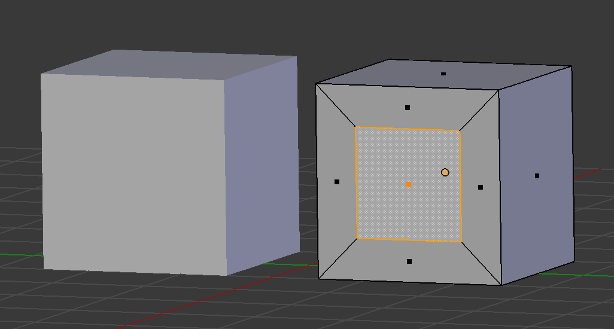
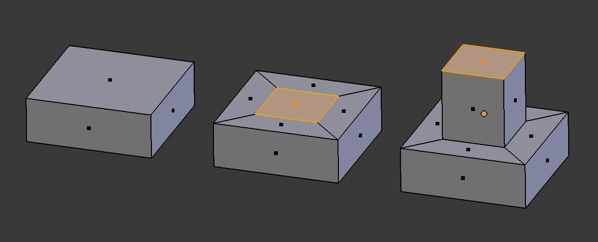
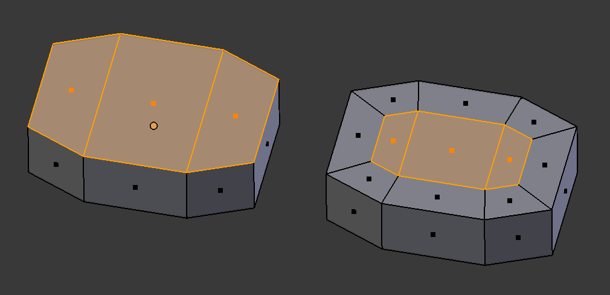
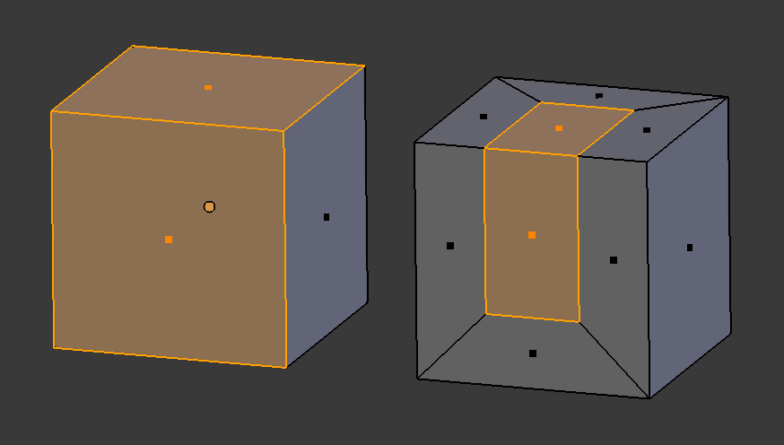
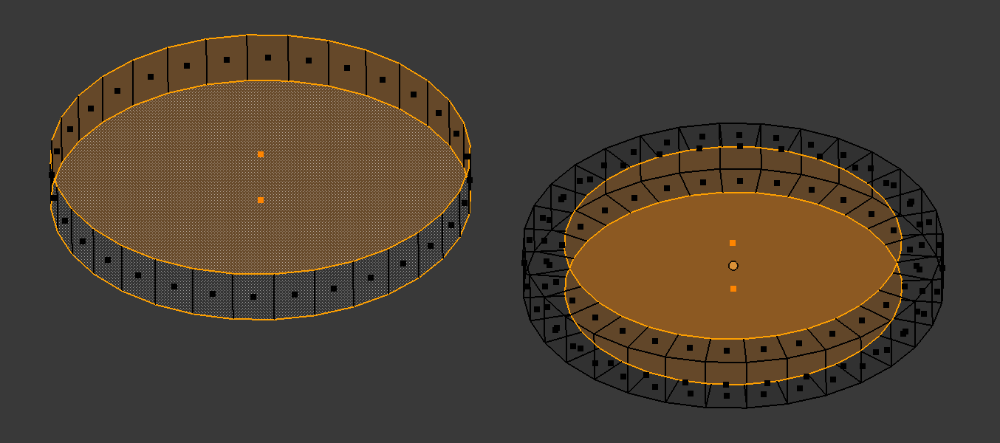
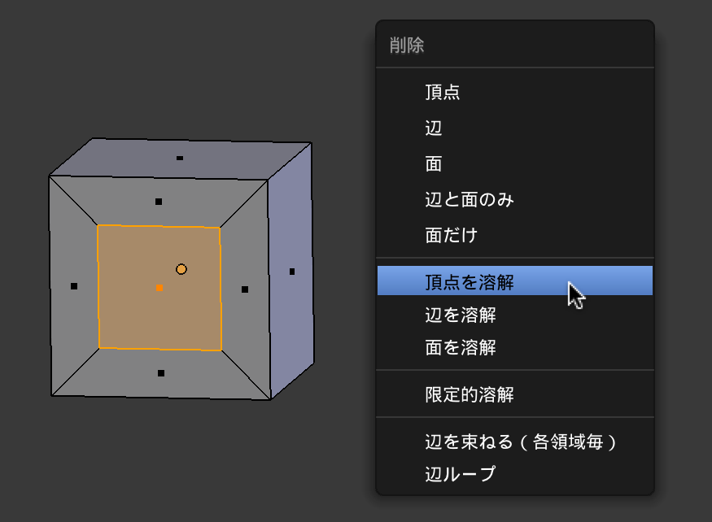
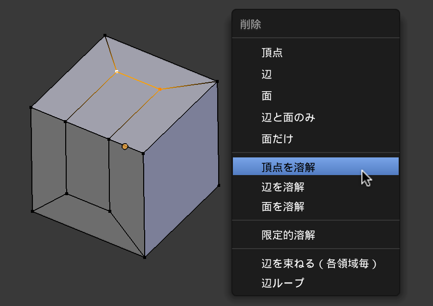

面の差し込みの基本
----

3D ビュー・エディタの編集モードで、あるオブジェクトの面を選択した状態で <kbd>I</kbd> キーを押すと、その面の内部にひとまわり小さい面を追加することができます（**面の差し込み**）。
下記の例では、元の直方体（左側）の前面に、ひとまわり小さい面を差し込んでいます（右側）。

{: .center }

1. 編集モード (Edit Mode) で面を選択する
2. <kbd>I</kbd> キーを押す
3. マウスを動かしてサイズを調整
4. <kbd>左クリック</kbd> で決定（<kbd>右クリック</kbd> でキャンセル）

<kbd>I</kbd> を押すときは、マウスカーソルの位置を面の中心から少し離した位置に配置して押すことをオススメします。
差し込む面のサイズ調整は、面の中心とカーソル位置の関係で決まるため、カーソル位置があまりにも面の中心に近いと調整がしにくくなってしまいます。

面の差し込みの応用
----

面の差し込みは、<kbd>E</kbd> による押し出しを行うための面を作るときによく実行されます。
下記の例では、面の一部を飛び出すように押し出していますが、逆に凹ませることもできます。

{: .center }

複数の面を選択した状態で <kbd>I</kbd> で「面を差し込む」と、それらの面の外周がひとまわり縮む感じで面が挿入されます。

{: .center }

この性質は、選択した面が隣接している限り有効で、下記のように角度のついた面同士でも「面の差し込み」を行うことができます。

{: .center }

逆に、隣接していない複数の面を選択した状態で <kbd>I</kbd> による「面の差し込み」を行うと、それぞれの面に対して独立して面が差し込まれます。
オブジェクトの表と裏に、同じサイズで面を差し込みたい場合などに便利です。
下記の例では、円柱の上面と底面を選択した状態で、「面の差し込み」を実行しています。
（裏面が見えるように、<kbd>Z</kbd> キーでワイヤーフレーム表示にしています）。

{: .center }

差し込まれた面を削除する
----

<kbd>I</kbd> キーの「面の差し込み」によって追加された面が必要なくなった場合は、削除したい面（あるいはそれを構成する頂点）を選択した状態で <kbd>X</kbd> (<kbd>Del</kbd>) キーを押し、<kbd><samp>頂点を溶解</samp></kbd> を選択します。

{: .center }

ただし、次のように、角度の付いた面にまたがって差し込まれた面を削除する場合は、それぞれの面の内部の頂点だけを選択して <kbd><samp>頂点を溶解</samp></kbd> を順番に実行していく必要があります（一度に溶解しようとすると、同じ平面上にない頂点同士が繋がって、おかしなポリゴンができてしまいます）。

{: .center }

あるいは、同じ平面上の面をすべて選択し、<kbd>X</kbd> → <kbd><samp>面を溶解</samp></kbd> とする方法もあります。

