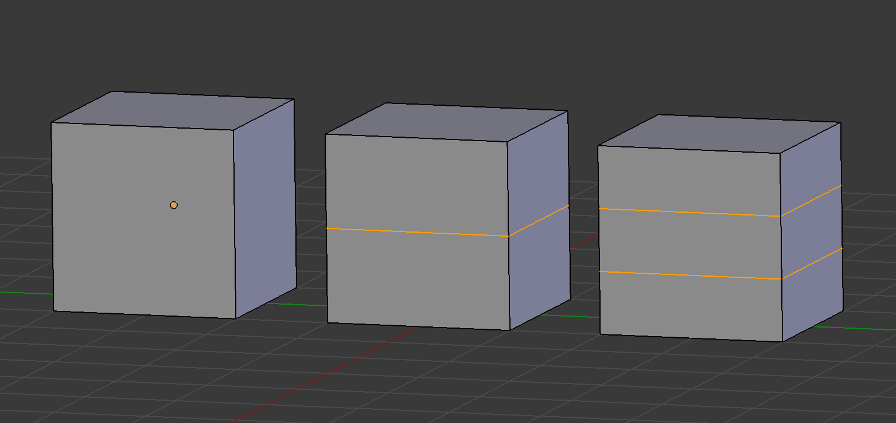

ループカットとは
----

編集モード (Edit Mode) でループカットの機能を使用すると、オブジェクトをぐるりと囲むように辺を追加することができます。

{: .center }

ループカットの基本
----

<kbd>Ctrl + R</kbd> を押して任意の辺にマウスカーソルを合わせると、紫色のラインが表示されるので、その状態で <kbd>左クリック</kbd> を押すとループカットが実行されます。
キャンセルしたい場合は、この紫色のラインが表示されている段階で <kbd>右クリック</kbd> か <kbd>Esc</kbd> キーを押してキャンセルしてください。
一度 <kbd>左クリック</kbd> すると、ループカットの実行はキャンセルできません。

一度 <kbd>左クリック</kbd> すると、辺の色がオレンジ色に変わり、マウスで辺の位置を調整できるようになります。
もう一度 <kbd>左クリック</kbd> すると、ループカットの位置が確定します。
代わりに <kbd>右クリック</kbd> か <kbd>Esc</kbd> キーで、均等にループカットすることができます。

<figure>
  
  <figcaption>
    <ol>
      <li><kbd>Ctrl + R</kbd> を押して起点となる辺にマウスカーソルを合わせる</li>
      <li><kbd>左クリック</kbd> でループカットを実行</li>
      <li>位置を調整して <kbd>左クリック</kbd> で位置を確定</li>
    </ol>
  </figcaption>
</figure>

ループカットで複数分割
----

<kbd>Ctrl + R</kbd> を押して紫色のラインが表示されている状態で、マウスホイールを回転させると、ループカットの数を調整することができます。
下記の例では、4 つのループカットを作成しています。

<figure>
  
  <figcaption>
    <ol>
      <li><kbd>Ctrl + R</kbd> を押して起点となる辺にマウスカーソルを合わせる</li>
      <li><kbd>マウスホイール</kbd> でループカット数を調整</li>
      <li><kbd>左クリック</kbd> でループカットを実行</li>
      <li>位置を調整して <kbd>左クリック</kbd> で位置を確定（ここでは <kbd>右クリック</kbd> で均等に分割）</li>
    </ol>
  </figcaption>
</figure>

（応用）ループカットの直後に別の編集操作を続ける
----

<kbd>Ctrl + R</kbd> → <kbd>左クリック</kbd> でループカットを実行した後は、ループカットの位置を調整するモードになりますが、この段階で <kbd>S</kbd>（伸縮）、<kbd>G</kbd>（移動）などの別のコマンドを開始すると、中央でループカットされたものとして編集を続けることができます。

<figure>
  
  <figcaption>
    <ol>
      <li><kbd>Ctrl + R</kbd> を押して起点となる辺にマウスカーソルを合わせる</li>
      <li><kbd>マウスホイール</kbd> でループカット数を調整</li>
      <li><kbd>左クリック</kbd> でループカットを実行</li>
      <li><kbd>G</kbd> キーでループカットした部分を移動</li>
      <li><kbd>S</kbd> キーでループカットした部分を伸縮</li>
    </ol>
  </figcaption>
</figure>

<kbd>Esc</kbd> によるループカット位置の確定操作すら省略したい人は、この技を使えば素早く操作できるようになります。
ループカットしてポリゴン数を増やしたということは、その辺りに何らかの修正を加えたいということですから、このように連続して編集することは理にかなっています。
逆に、ループカットだけして何も修正しないというのは避けましょう（ポリゴン数は少ない方がよい）。

