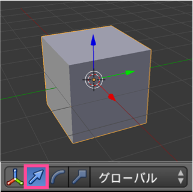

マニピュレータを使う方法
----

{:.center}

1. オブジェクトを選択（オブジェクトモードで右クリック）
2. 移動マニピュレータに切り替える
3. 中央の白い円、あるいは、3色（赤緑青）の矢印をドラッグ （右クリック or <kbd>ESC</kbd> でキャンセル）

マニピュレータ中央の白い円をドラッグすると、オブジェクトを任意の方向に移動することができます。
マニピュレータの3色の矢印をドラッグすると、オブジェクトをx軸方向（赤の矢印）、y軸方向（緑の矢印）、z軸方向（青の矢印）に移動することができます。

<kbd>Shift</kbd> キーを押しながら矢印をドラッグすると、その軸以外の方向に（その軸の位置だけ固定して）移動することができます。
例えば、<kbd>Shift</kbd> キーを押しながら青の矢印（z軸）をドラッグすると、地面に水平な方向（x軸、y軸）方向にだけオブジェクトを移動することができます。

ショートカットキーを使う方法
----

1. オブジェクトを選択（オブジェクトモードで右クリック）
2. <kbd>G</kbd> キーを押す
3. マウスを動かしてオブジェクトを移動させる
4. クリックで位置を決定 （右クリック or <kbd>ESC</kbd> でキャンセル）

マウスを動かしてオブジェクトを移動させている最中に、<kbd>x</kbd> キー、<kbd>y</kbd> キー、<kbd>z</kbd> キーを押すと、移動方向をその軸だけに制限できます（マニピュレータの矢印をドラッグするのと同様）。
<kbd>Shift</kbd> を押しながら <kbd>x</kbd> キー、<kbd>y</kbd> キー、<kbd>z</kbd> キーを押すと、その軸以外の方向に移動することができます（マニピュレータの矢印を <kbd>Shift</kbd> キーを押しながらドラッグするのと同様）。

