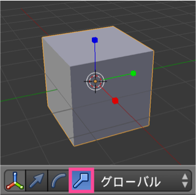

マニピュレータを使って拡大／縮小する方法
----

{:.center}

1. オブジェクトを選択（オブジェクトモードで右クリック）
2. 拡大縮小マニピュレータに切り替える（上図のピンク枠のアイコン）
3. 中央の白い円、あるいは、3色（赤緑青）の線をドラッグして拡大／縮小 （拡大／縮小中に、右クリック or <kbd>ESC</kbd> でキャンセル）

中央の白い円をドラッグすると、オブジェクト全体が拡大／縮小することができます。
赤、緑、青の3色の線をドラッグすると、それぞれ、x軸方向（赤）、y軸方向（緑）、z軸方向（青）にだけ拡大／縮小することができます。

<kbd>Shift</kbd> キーを押しながら、3色の線をドラッグすると、その軸以外の方向に拡大／縮小することができます。
例えば、<kbd>Shift</kbd> キーを押しながら青色の線（z軸）をドラッグすると、オブジェクトはx軸とy軸方向に拡大／縮小されます。

ショートカットキーを使って拡大／縮小する方法
----

1. オブジェクトを選択（オブジェクトモードで右クリック）
2. <kbd>S</kbd> キーを押す（Scale の略）
3. マウスを動かしてオブジェクトを拡大／縮小させる
4. クリックで大きさを確定 （拡大／縮小中に、右クリック or <kbd>ESC</kbd> でキャンセル）

<kbd>S</kbd> キーを押した瞬間に、オブジェクト全体のサイズをマウスの動きで調整できるようになります。
マウスを動かしてオブジェクトを拡大／縮小させている最中に、<kbd>X</kbd> キー、<kbd>Y</kbd> キー、<kbd>Z</kbd> キーを押すと、拡大／縮小の方向（軸）を固定することができます（マニピュレータの3色の線をドラッグするのと同様）。

<kbd>Shift</kbd> を押しながら <kbd>X</kbd> キー、<kbd>Y</kbd> キー、<kbd>Z</kbd> キーを押すと、その軸以外の方向に拡大／縮小することができます（マニピュレータの線を <kbd>Shift</kbd> キーを押しながらドラッグするのと同様）。

より具体的には、オブジェクトの拡大／縮小中に <kbd>X</kbd> を押すと、グローバルなx軸上で拡大／縮小するようになります。続けてもう一度 <kbd>X</kbd> を押すと、ローカルなx軸上で拡大／縮小するようになります。

マウスでの拡大／縮小の単位を大きくする／小さくする
----

オブジェクトをマウスのドラッグで拡大／縮小させているときに、<kbd>Ctrl</kbd> キーを押しながらドラッグすると、少し大きな単位で拡大／縮小できるようになります。
逆に、<kbd>Shift</kbd> キーを押しながらドラッグすると、細かい単位で拡大／縮小されるようになるため、大きさを微調整することができます。

拡大縮小マニピュレータの3色の線を <kbd>Shift</kbd> キーを押しながらドラッグし始めた場合（その軸以外の方向への拡大／縮小）は、既に <kbd>Shift</kbd> キーが押されている状態になっています。このようなケースでは、一度 <kbd>Shift</kbd> キーを離してから、再び <kbd>Shift</kbd> を押しながらドラッグを継続することで、細かい単位での拡大／縮小に切り替えることができます。

ショートカットキーで拡大／縮小の倍率を指定する
----

次のようにすると、ショートカットキーだけでオブジェクトを拡大／縮小することができます。

1. オブジェクトを選択状態にする
2. <kbd>S</kbd> キーで拡大／縮小開始
3. 必要があれば、<kbd>X</kbd> or <kbd>Y</kbd> or <kbd>Z</kbd> キーで拡大／縮小の方向を固定する（何もしなければオブジェクト全体を拡大／縮小）
4. 数字キーで倍率を入力（2倍にするなら <kbd>2</kbd> と入力）
5. <kbd>Enter</kbd> キーで決定

倍率は、拡大／縮小後オブジェクトのサイズを指定するのではなく、あくまで現在のサイズを基準にして何倍にするかを指定することに注意してください。
サイズを 1/2 にしたいのであれば、0.5 と入力します。

#### 例: オブジェクト全体のサイズを2倍にする

~~~
S 2 Enter
~~~

#### 例: オブジェクト全体のサイズを半分にする

~~~
S 0.5 Enter
~~~

サイズを半分にしたいときは、`0.5` と入力する代わりに、`/2` あるいは、`2/` と入力することもできます。
次の操作は、上記の操作と同様の効果があります。

~~~
S / 2 Enter
~~~

どちらも同じ効果がありますが、前者の方法で縮小しようとすると、`0` を入力した時点でオブジェクトが 0 倍のサイズになってしまうため、一時的に見えなくなってしまいます。
それが気になる場合は、後者の方法で縮小するようにするとよいでしょう。
また、サイズを 1/3 にしたいときなどは、`0.3333` と入力するより、`/3` と入力する方が直感的です。

移動操作 (<kbd>G</kbd>) や、回転操作 (<kbd>R</kbd>) と同様に、拡大／縮小操作 (<kbd>R</kbd>) も適用する軸の方向を制限することができます。

#### 例: オブジェクトをZ軸方向に3倍に拡大する

~~~
S Z 3 Enter
~~~

#### 例: オブジェクトをZ軸以外の方向（X軸とY軸方向）に3倍に拡大する

~~~
S Shift+Z 3 Enter
~~~

実は、<kbd>S</kbd> キーを押した後のキー入力の順序は、ある程度柔軟性があります。
次の操作は最終的に全て同じ結果になります。

#### 例: オブジェクトをX軸方向に半分に縮小

~~~
S X / 2 Enter
S X 2 / Enter
S / X 2 Enter
S / 2 X Enter
S 2 X / Enter
S 2 / X Enter
~~~

このような柔軟性があることで、ちょっと分かりにくい動作をすることもあります。
例えば、サイズを 1/2 にしたいときに、次のように入力することはできません。

#### 例: 間違った例（1/12 に縮小される）

~~~
S 1 / 2 Enter
~~~

数値は離して入力しても、連続して入力したのと同じように振る舞います。
つまり、上記は次のように入力したのと同じ振る舞いになってしまいます。

~~~
S / 12 Enter
~~~

