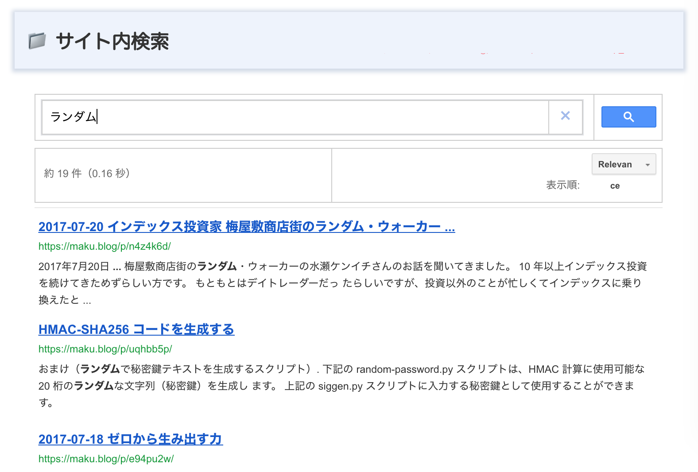

Google カスタム検索エンジンに自分のサイトを登録する
----

まず、Google カスタム検索エンジンを適用する Web サイトは、インターネット上に公開されている必要があります。
プライベートな Hugo サーバーを使用する場合に検索機能を付けたい場合は、[自己完結する全文検索の仕組み](./full-text-search.html) を導入する必要があります。
ここでは、すでにインターネット上に公開されている Web サーバーがあるという前提で話を進めます。

カスタム検索エンジンの登録は下記のサイトから行えます。

- [Google カスタム検索エンジン](https://cse.google.com/)

<samp>新しい検索エンジン</samp> というボタンを押して、自分の Web サイトのアドレスを入力するだけで登録は完了します。


検索ページを表示する
----

Web サイトをカスタム検索エンジンに登録すると、Google のサーバ上に、カスタム検索用のページが作成されます。
[カスタム検索のコントロールパネル](http://cse.google.com/all) から、登録した検索エンジンを選択し、<samp>公開 URL</samp> の欄を確認してみてください。
下記のようなアドレスが生成されているはずです（下記アドレスの cx パラメータ部分は適当です）。

```
https://cse.google.com/cse?cx=207539779230035260336:1pkduco3un7
```

あとは、Markdown ファイルの中から、次のようにリンクを張ってやれば、即席のカスタム検索サイトの完成です。

```markdown
[サイト内検索](https://cse.google.com/cse?cx=207539779230035260336:1pkduco3un7)
```

#### 表示例

{: .center }


Hugo のページ内に検索フォームと検索結果を表示する
----

上記のやり方では、Google のサーバ上に生成された検索ページへただジャンプするだけでした。
ここでは、Hugo の記事ページ内に検索フォームと、検索結果を表示できるようにしてみます。

まず、カスタム検索のサイトから、ページ埋め込み用の HTML コードを取得します。

{: .center }

1. [カスタム検索のコントロールパネル](http://cse.google.com/all) から、登録した検索エンジンを選択する
2. <samp>デザイン</samp> のタブから、<samp>全幅</samp> のデザインを選択する
3. <samp>保存してコードを取得する</samp> ボタンを押す

上記のようにポチポチ入力していくと、下記のようなコードが取得できるはずです（バージョンにより変更される可能性があります）。

```html
<script async src="https://cse.google.com/cse.js?cx=207539779230035260336:1pkduco3un7"></script>
<div class="gcse-search"></div>
```

後は、このコードを、任意の記事ページの Markdown ファイル内にコピペするだけです。

#### content/custom-search/_index.md

```markdown
---
title: "サイト内検索"
---

<script async src="https://cse.google.com/cse.js?cx=207539779230035260336:1pkduco3un7"></script>
<div class="gcse-search"></div>
```

下記は、実際に Hugo を使ったサイト内のページにカスタム検索を埋め込んだときの表示例です。

{: .center }

検索フォームに余計な枠線が表示されていたり、微妙にレイアウトが崩れてしまっているのが分かります。
これは、その Web サイトのスタイル設定が Google の検索フォームにも影響してしまっているからです。
このようなレイアウトの崩れを防ぐ一番手っ取り早い方法は、先に示した、Google のサーバ上に生成された検索ページに飛ばしてしまう方法です。


検索フォームだけ独自コードで設置する
----

最初の例で示したように、Google のサーバー上に生成される検索ページのアドレスは次のようになっています。

```
https://cse.google.com/cse?cx=＜検索エンジンID＞
```

実は、このアドレスの後ろに、次のように検索ワードを追加して開くと、検索結果を表示した状態で検索ページを開くことができます。

```
https://cse.google.com/cse?cx=＜検索エンジンID＞&q=＜検索ワード＞
```

つまり、このようなアドレスを開くための FORM 要素を設定してやることで、直接カスタム検索の結果にジャンプできる検索フォームを作成できます。
下記は、FORM 要素の記述例です（`cx` パラメータの値は、あなたの Web サイト用の検索エンジン ID に変更してください）。

```html
<form action="https://cse.google.com/cse">
  <div class="searchBox">
    <input type="hidden" name="cx" value="207539779230035260336:1pkduco3un7" />
    <input type="hidden" name="ie" value="UTF-8" />
    <input type="search" name="q" placeholder="サイト内検索" size="30" autocomplete="off" />
    <input type="submit" value="検索" />
  </div>
</form>
```

ここでは、DIV 要素に `searchBox` というクラスを割り当てているので、このクラスに対する CSS スタイルを設定してやれば、見た目のカスタマイズは自由に行えます。

```css
.searchBox > input {
    font-size: 16px;
    vertical-align: middle;
    border-radius: 3px;
}
.searchBox > input[type="search"] {
    border: solid 1px #ccc;
    padding: 0.5em;
}
.searchBox > input[type="submit"] {
    background: #ff3c5f;
    color: white;
    font-weight: bold;
    border: none;
    margin-left: 0.3em;
    padding: 0.5em 1em;
}
```

#### 表示結果

{: .center }


### パーシャルテンプレート化する

こういった検索フォームは、すべてのページに設置することが多いでしょうから、Hugo では下記のような感じで、レイアウトファイルからパーシャルテンプレートとして呼び出せるようにしておくと便利です。

#### layouts/_default/single.html（抜粋）

```
{{ "{{" }} partial "custom-search" . }}
```

下記は `custom-search` パーシャルテンプレートの記述例です。
ここでは、Hugo の設定ファイルで `CustomSearchId` という独自パラメータが設定されている場合のみ、カスタム検索のフォームを表示するようにしています（最初の `with` による分岐）。

#### layouts/partials/custom-search.html

```
{{ "{{" }}- with .Site.Params.CustomSearchId }}
<form action="https://cse.google.com/cse">
  <div class="searchBox">
    <input type="hidden" name="cx" value="{{ "{{" }} . }}" />
    <input type="hidden" name="ie" value="UTF-8" />
    <input type="search" name="q" placeholder="サイト内検索" size="30" autocomplete="off" />
    <input type="submit" value="検索" />
  </div>
</form>
{{ "{{" }}- end }}
```

設定ファイルには下記のように検索エンジン ID を設定しておきます。

#### config.toml（抜粋）

```toml
[params]
  CustomSearchId = "207539779230035260336:1pkduco3un7"
```


参考
----

- [全文検索（インクリメンタルサーチ）の機能を付ける](./full-text-search.html)

