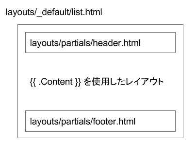

Hugo のテンプレート構成では、下記のような感じでテンプレート前半部分と後半部分をまるごとパーシャルファイルで構成してしまうのが一般的のようです。

{: .center }

上記ではリストテンプレート (list.html) の例を示していますが、ホームページテンプレート (layouts/index.html) や、セクションテンプレート (layouts/_default/section.html)、シングルページテンプレート (layouts/_default/single.html) などを記述する際も同様に構成します。
つまり、パーシャルファイルとして作成する `header.html` や `footer.html` は、どのテンプレートファイルからでも使用できるように、汎用的な記述をしておく必要があります。

#### layouts/partials/header.html

~~~ html
<!DOCTYPE html>
<html lang="{{ "{{" }} .Site.LanguageCode }}">
<head>
  <meta charset="UTF-8">
  <meta name="viewport" content="width=device-width,initial-scale=1.0">
  <link rel="stylesheet" href="/assets/css/main.css">
  <title>{{ "{{" }} if not .IsHome }}{{ "{{" }} .Title }} | {{ "{{" }} end }}{{ "{{" }} .Site.Title }}</title>
  {{ "{{" }} partial "header-favicon" . }}
</head>
<body>
~~~

#### layouts/partials/footer.html

~~~ html
</body>
</html>
~~~

上記のようなパーシャルテンプレートは、各レイアウト用のテンプレートから次のように使用します。

#### layouts/_default/list.html

~~~ html
{{ "{{" }} partial "header" . }}

<main id="main">
  <h1>{{ "{{" }} .Title }}</h1>
  {{ "{{" }} .Content }}
</main>

{{ "{{" }} partial "footer" . }}
~~~

ここでは、リストテンプレート内で使用する方法を示していますが、ホームテンプレートや、シングルページテンプレートなどでも同様に使用できます。

