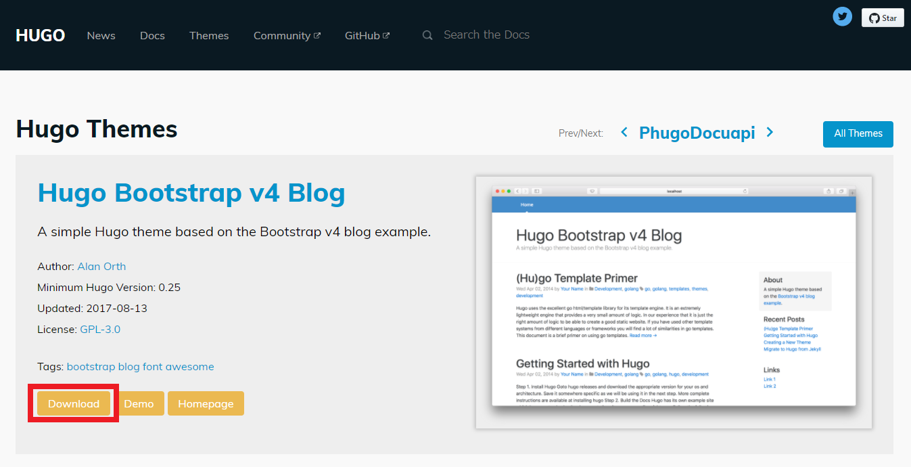

テーマをダウンロードする
----

Hugo で Web サイトを生成するときは、外観のベースとなる**テーマ**を１つ設定してやる必要があります。
テーマを設定せずに `hugo` コマンドで Web サイトを出力しても、真っ白なページが表示されてしまうだけです。

テーマは自分で作成することもできますが、[Hugo Themes](https://themes.gohugo.io/) というサイトに、有志の人によって作られたテーマが公開されていますので、まずはここからダウンロードして使ってみるのがよいでしょう。
使用方法はテーマごとに少しずつことなるので、詳細はそれぞれのテーマの説明 (`README.md`) を読んでください。

例えば、下記の [hugo-theme-bootstrap4-blog というテーマ](https://github.com/alanorth/hugo-theme-bootstrap4-blog) がよさそうであれば、Download ボタンを押します。

{: .center}

通常は、GitHub のサイトに飛ぶので、「Clone or download」のボタンを押してテーマをダウンロードしてください。

{: .center}

ダウンロードしたテーマは、プロジェクトの `themes` ディレクトリに配置します。
このケースでは、`themes/hugo-theme-bootstrap4-blog-master` ディレクトリとして配置します。

テーマは GitHub 上で管理されていますので、[Git](/git/) コマンドが使える環境であれば、下記のようにコマンドからダウンロードしてしまうのが簡単です。

~~~
$ cd themes
$ git clone https://github.com/alanorth/hugo-theme-bootstrap4-blog.git
~~~

テーマの初期設定
----

テーマによっては、外部コンポーネントに依存していて、初期設定が必要なものもあります。
上記の hugo-theme-bootstrap4-blog テーマでは、下記のように関連モジュールをインストールしてくださいと説明がありますので、その通りに実行しておきます。

~~~
$ npm install
$ npm run build
~~~

ちなみに、`npm` は Node.js 用のパッケージマネージャで、[Node.js](https://nodejs.org) をインストールすれば一緒にインストールされます。

使用テーマを設定する
----

テーマは `themes` ディレクトリにいくつでもダウンロードしておくことができます。
その中から実際に使用するテーマは、Hugo の設定ファイルの中で以下のように設定します。

#### config.toml

~~~ toml
theme = "hugo-theme-bootstrap4-blog-master"
~~~

テーマを設定したら、`hugo` コマンドで Web サイトを生成してみてください。
設定したテーマをもとに、`public` ディレクトリ以下にアップロード用のファイル群が出力されるはずです。

~~~
$ hugo
~~~

`hugo server` コマンドで、Web サーバを立ち上げる場合にも `config.toml` で設定したテーマが使用されます。

設定ファイルを変更せずに、一時的に別のテーマを試してみたい場合は、`-t` オプションでテーマ名を指定して `hugo` コマンドを実行します。

~~~
$ hugo -t theme_name        （サイトを出力する場合）
$ hugo server -t theme_name （Web サーバを立ち上げる場合）
~~~

