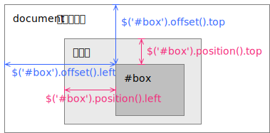

要素の位置を取得する API
----

ある HTML 要素の左上の座標を取得するには次のようにします。
ページの左上からの絶対座標や、親要素からの相対座標で取得することができます。

#### jQuery の例

~~~ javascript
var $e = $('#box');

// document（ページ左上）からの絶対座標
var x1 = $e.offset().top;
var y1 = $e.offset().left;

// 親要素の左上を (0,0) とした相対座標
var x2 = $e.position().top;
var y2 = $e.position().left;
~~~

{: .center }

ここで、**親要素としてみなされるのは、`position` 属性に `relative`、`absolute`、`fixed` のいずれかをもつ直近の親要素**です。
`$e.position()` でうまく値が取れない場合は、親要素にこの指定を忘れていることが多いので注意してください（デフォルトの `position: static` のままになっている）。

次のデモでは、div 要素 (`#box`) の座標をリアルタイムに取得して表示しています。
これらの座標値は、**ページをスクロールしても変化しない**ところがポイントです（ただし、ズームを行ってレイアウトが崩れた場合などは、座標値が変化することがあります）。

#### デモ（<a target="_blank" href="elem-pos-demo.html">別ウィンドウで開く</a>）

<iframe class="maku-htmlDemo" src="elem-pos-demo.html"></iframe>

#### プレーンな JavaScript (Vanilla JavaScript) の例

~~~ javascript
var e = document.getElementById('box');
var rect = e.getBoundingClientRect();  // 画面左上を基準とする位置

// document（ページ左上）からの絶対座標
var x1 = rect.top + window.pageYOffset;
var y1 = rect.left + window.pageXOffset;

// 親要素の左上を (0,0) とした早退座標は、計算が複雑なので省略。。。
~~~

jQuery を使わずに `offset()` 相当の座標値を取得するには、上記のように若干の計算が必要です。

ウィンドウ左上を基準にした要素の位置を取得
----

ウィンドウ（表示領域）の左上を原点 (0, 0) とみなした相対座標で要素の位置を取得するには次のようにします。

#### プレーンな JavaScript (Vanilla JavaScript) の例

~~~ javascript
var e = document.getElementById('box');

// スクリーン左上を (0, 0) とした相対座標
var rect = e.getBoundingClientRect();
console.log(rect.top);
console.log(rect.left);
~~~

#### jQuery を使った例（jQuery 用の独自の関数はない）

~~~ javascript
var $e = $('#box');

// スクリーン左上を (0, 0) とした相対座標
var rect = $e.get(0).getBoundingClientRect();
console.log(rect.top);
console.log(rect.left);
~~~

{: .center }

この座標値は、ウィンドウ内で表示されている要素の位置が変化すると同時に変化します。
要素が画面の上に隠れている場合は、`top` プロパティの値はマイナスになります。

