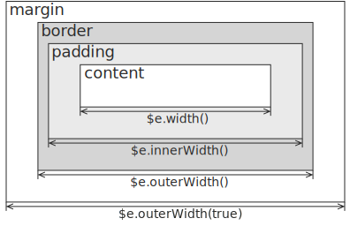

{: .center }

要素のサイズを取得する API
----

ここでは、下記のようなテスト用の div 要素を使用します。

~~~ html

あああああいいいいい

~~~

この要素のサイズは、下記のようにして取得することができます。

#### jQuery を使用した場合

~~~ javascript
var $e = $('#box');

// コンテンツ領域のみのサイズ
var w1 = $e.width();
var h1 = $e.height();

// padding を含むサイズ
var w2 = $e.innerWidth();
var h2 = $e.innerHeight();

// padding と border を含む幅
var w3 = $e.outerWidth();
var h3 = $e.outerHeight();

// padding と border と margin を含む幅
var w4 = $e.outerWidth(true);
var h4 = $e.outerHeight(true);
~~~

jQuery を使わずに、プレーンな JavaScript (Vanilla JavaScript) でやろうとすると、若干わかりにくいコードになります。

#### (Vanilla) JavaScript の場合

~~~ javascript
var e = document.getElementById('box');

// padding も border も含まないサイズ
var w1 = parseInt(window.getComputedStyle(e).width);
var h1 = parseInt(window.getComputedStyle(e).height);

// padding を含むサイズ
var w2 = e.clientWidth;
var h2 = e.clientHeight;

// padding と border を含む幅
var w3 = e.offsetWidth;
var h3 = e.offsetHeight;
~~~

特に、padding を含まない content 領域のみのサイズを求めるときに使用している `window.getComputedStyle` 関数は、`50px` のような単位付きの文字列を返すので、これを `50` という数値に変換するために `parseInt` を使用しています。

要素のサイズを調べるデモ
----

下記のデモでは、テスト用の div 要素のサイズや padding、border を次のように指定し、それぞれのサイズがどのように取得されるかを調べています。

~~~ css
#box {
  width: 50px;
  height: 50px;
  padding: 5px;
  margin: 10px;
  border: solid 10px red;
  background: lightcyan;
}
~~~

#### デモ（<a target="_blank" href="elem-size-demo.html">別ウィンドウで開く</a>）

<iframe class="maku-htmlDemo" src="elem-size-demo.html"></iframe>

例えば、`$e.outerWidth()` は、コンテンツ分 (50px) + padding分 (10px) + border分 (20px) = 80px と計算されています。

