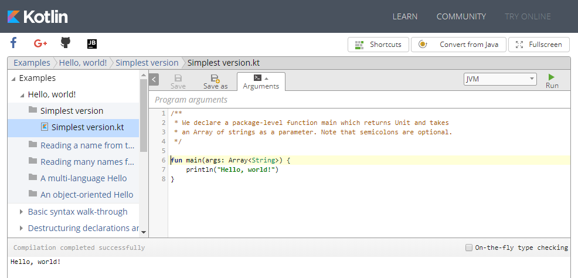
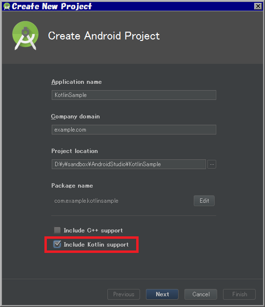

Kotlin の特徴
----

[Kotlin](https://kotlinlang.org/) は **Java との親和性を重視して作成されたコンパイル型の言語**です。
IntelliJ IDEA の開発元である JetBrains 社によって作成された言語であり、強力な IDE のサポートがあります。

2017年の Google I/O で、Google が Android における Kotlin の公式サポートを発表したため、言語としての知名度が一気に向上しました。

Kotlin には次のような特徴があります。

* Kotlin のコンパイラ (kotlinc) は、Java の仮想マシン JVM 上で動作する `.class` ファイルを生成します。
* Kotlin で作成したコードを Java コードから簡単に呼び出せます。逆に、Kotlin から Java のコードを利用するのも容易です。
* Java で作成されたフレームワークやライブラリをそのまま使用することができます。
* Gradle や Ant などを使ってビルドすることができます。
* 上記のような特徴により、**1 つのプロジェクト内に Java のコードと Kotlin のコードを共存**させることができます。
* **Java に比べて少ない記述量**で同等以上のことを実現することができます。文末のセミコロンがいらなかったり、型名を省略できたり、ラッパー関数があったり。
* Java と同様に静的型付き言語 (Statically typed language) ですが、多くの場合はコンパイラによる推論 (type inference) により型名を省略できます（コンパイル時に型が確定することは変わりありません）。
* **Null 非許容型などを言語的にサポート**するため、メンテナンス性の高いコードを記述できます。
* Java と同様にオブジェクト指向言語として扱えますが、**関数型プログラミング (Functional programming) を言語レベルでサポート**しています。
    * 関数をパラメータとして受け取ったり、戻り値で返したりすることができます。
    * Lambda 式という小さなコードブロックを受け渡しすることができます。
    * Data class というイミュータブルなオブジェクトを作成するための簡潔な構文が用意されています。
    * コレクションを関数型プログラミングのスタイルで扱う API が用意されています。
* JavaScript へのトランスパイルが検討されています（Kotlin コード → JavaScript コードへの変換）。

Kotlin の開発環境のインストールと HelloWorld
----

### Try Kotlin のサイトで試してみる

簡単な Kotlin のコードであれば、下記のサイト上で直接実行することができます。

- [Try Kotlin](https:/try.kotlinlang.org/)

{: .center }

左側のペーンでサンプルコードを選択して Run ボタンを押せば、実行結果が下の出力エリアに表示されます。
エディタ部分には、任意のコードを入力することができるため、簡単な文法テストだけであれば、このサイト上だけで済ませてしまうことができます。

### IDE (IntelliJ IDEA) を使用する

JetBrains 社が提供している IntelliJ IDEA という統合開発環境 (IDE) は、ネイティブで Kotlin による開発をサポートしています。
Community Edition であれば無料で使用することができますので、Kotlin で本格的に開発を行いたい場合はインストールしておくとよいでしょう。
Kotlin の生みの親である JetBrains 社が作成している IDE ですので、今後も長期的にリリースが続くと思われます。

- [IntelliJ IDEA - JetBrains](https://www.jetbrains.com/idea/)

IntelliJ IDEA でプロジェクトを作成するときに、Kotlin を選択すれば開発準備 OK です。

{: .center }

### IDE (Android Studio) を使用する

Kotlin で Android アプリを作成するときは、[Android Studio](https://developer.android.com/studio/) に Kotlin サポートを追加して使用します。
プロジェクトの作成時に下記のように **Include Kotlin support** にチェックを入れてやれば、スケルトンコードも Kotlin ファイルとして生成されます（`MainActivity.kt` などが生成されます）。

{: .center }

### Kotlin のスタンドアロン・コンパイラ (kotlinc) を使用する

Kotlin のスタンドアロン・コンパイラをインストールしておけば、**`kotlinc`** コマンドを使用して Kotlin のソースコード (.kt) をコンパイルすることができます。
下記のサイトに各環境でのインストール方法が説明されています。

- [Kotlin - Command Line Compiler](https://kotlinlang.org/docs/tutorials/command-line.html)

macos であれば、上記サイトに記載されている通り、Homebrew（`brew` コマンド）などを使ってインストールしてしまうのが簡単です。
Windows であれば、GitHub 上 [Kotlin リリースページ](https://github.com/JetBrains/kotlin/releases/) からアーカイブをダウンロードして、`bin` ディレクトリに PATH を通してやれば OK です。

`kotlinc` コマンドが実行できるようになったら、下記のようなサンプルコードをコンパイルして実行してみましょう。
ビルド後のアプリケーションは、Java アプリケーションと同様に `java` コマンドを使用して実行することができます。

#### sample.kt

~~~ kt
fun main(args: Array<String>) {
    println("Hello, world!")
}
~~~

#### コンパイル

~~~
$ kotlinc sample.kt -include-runtime -d sample.jar
~~~

#### 実行

~~~
$ java -jar sample.jar
Hello, world!
~~~

`kotlinc` でコンパイルしたアプリケーションの実行には、Kotlin ランタイムが必要です。
`kotlinc` の **`-include-runtime`** オプションは、生成する JAR ファイル内にこの Kotlin ランタイムを含めてしまう指定です。
このようにして作成した JAR ファイルは、上記のように単独で実行することができます。

