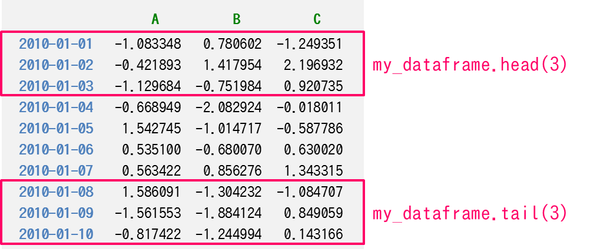
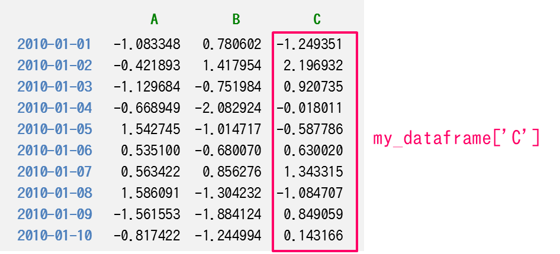
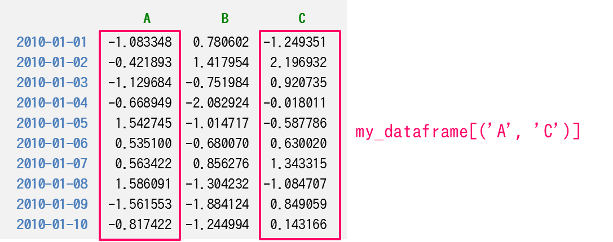

サンプルデータ
----

下記のサンプルでは、10 のデータを持つ `DataFrame` を生成しています。

~~~ python
import numpy as np
import pandas as pd

data = np.random.randn(10, 3)  # 10x3 の乱数データを生成
indices = pd.date_range('2010-01-01', periods=10)  # インデックス名は日付
columns = ('A', 'B', 'C')  # カラム名

my_dataframe = pd.DataFrame(data, index=indices, columns=columns)
print(my_dataframe)
~~~

#### 実行結果

~~~
                   A         B         C
2010-01-01 -1.083348  0.780602 -1.249351
2010-01-02 -0.421893  1.417954  2.196932
2010-01-03 -1.129684 -0.751984  0.920735
2010-01-04 -0.668949 -2.082924 -0.018011
2010-01-05  1.542745 -1.014717 -0.587786
2010-01-06  0.535100 -0.680070  0.630020
2010-01-07  0.563422  0.856276  1.343315
2010-01-08  1.586091 -1.304232 -1.084707
2010-01-09 -1.561553 -1.884124  0.849059
2010-01-10 -0.817422 -1.244994  0.143166
~~~

行方向に絞り込んで抽出する
----

### 先頭／末尾の数データのみ抽出する (pd.DataFrame.head / pd.DataFrame.tail)

`DataFrame.head()` や `DataFrame.tail()` を使用すると、巨大なデータフレームから、先頭あるいは末尾の数データのみを抽出することができます。
最新のデータを取得したいときや、データ構成を簡単に把握したいときに便利です。
戻り値の型は `DataFrame` です。

~~~ python
print(my_dataframe.head(3))  # 先頭の 3 つのデータのみ抽出 => DataFrame
print(my_dataframe.tail(3))  # 末尾の 3 つのデータのみ抽出 => DataFrame
~~~

{:.center}

#### 実行結果

~~~
                   A         B         C
2010-01-01 -1.083348  0.780602 -1.249351
2010-01-02 -0.421893  1.417954  2.196932
2010-01-03 -1.129684 -0.751984  0.920735
                   A         B         C
2010-01-08  1.586091 -1.304232 -1.084707
2010-01-09 -1.561553 -1.884124  0.849059
2010-01-10 -0.817422 -1.244994  0.143166
~~~

`head()` や `tail()` のパラメータを省略すると、デフォルトで 5 つのデータが抽出されます。

### インデックスの範囲指定でデータを抽出する

インデックス番号やインデックス名で範囲を指定して配列風にアクセスすると、その範囲の部分データを抽出することができます。
単一のインデックス指定ではなく、どのケースも範囲指定になっていることに注意してください。
戻り値は `DataFrame` オブジェクトです。

~~~ python
print(my_dataframe[0:3])  # 先頭の 3 つのデータを取得
print(my_dataframe[:3])   # 同上
print(my_dataframe[-2:])  # 末尾の 2 つのデータを取得
print(my_dataframe['2010-01-05':'2010-01-07'])  # インデックス名で範囲指定
~~~

{:.center}

### 特定のインデックスのデータを抽出する

`DataFrame.loc` を使用すると、特定のインデックスのデータのみを `Series` オブジェクトとして取得することができます（配列風に１つのラベル名だけを指定してアクセスすると、インデックス名ではなくカラム名を指定したことになってしまうので（列方向の抽出）、インデックス名を指定するための `loc` が用意されています）。

~~~ python
print(my_dataframe.loc['2010-01-01'])  # 特定インデックスのデータを取得 => Series
print(my_dataframe.iloc[0])            # 番号指定の場合は iloc を使う => Series
~~~

{:.center}

#### 実行結果

~~~
A   -1.083348
B    0.780602
C   -1.249351
Name: 2010-01-01 00:00:00, dtype: float64
~~~

DataFrame ではカラム名だった A, B, C が、Series データのインデックス名になっていることに注意してください。

列方向（カラム）で絞り込んで抽出する
----

### 特定のカラムのデータを抽出する

カラム名を１つだけ指定すると、そのカラムのすべてのデータが `pd.Series` データとして抽出されます（この場合はインデックスではなく、カラムを指定していることに注意してください）。
戻り値は一次元データなので `Series` 型になります。

~~~ python
print(my_dataframe['C'])  # カラム名 'C' の全データ => Series
~~~

{:.center}

#### 実行結果

~~~
2010-01-01   -1.249351
2010-01-02    2.196932
2010-01-03    0.920735
2010-01-04   -0.018011
2010-01-05   -0.587786
2010-01-06    0.630020
2010-01-07    1.343315
2010-01-08   -1.084707
2010-01-09    0.849059
2010-01-10    0.143166
Freq: D, Name: C, dtype: float64
~~~

特定のカラムのデータを `Series` ではなく、`DataFrame` として抽出するには次のようにします。

~~~ python
print(my_dataframe[('C')])  # カラム名 'C' の全データ => DataFrame
~~~

この記法では、複数のカラムを指定することもできます。

~~~ python
print(my_dataframe[('A', 'C')])  # カラム名 'A' と 'C' の全データ => DataFrame
~~~

{:.center}

インデックスラベルとカラムを両方指定して取得
----

インデックスとカラムの範囲は自由に組み合わせて指定することができます。
戻り値の型はデータの抽出範囲によって変わってくることに注意してください。
取得結果が一次元データとなる場合は Series オブジェクト、二次元データとなる場合は DataFrame オブジェクトとなります。

~~~ python
print(my_dataframe.loc['2010-01-01', 'A'])               # 単一インデックス ＋ 単一カラム指定 => numpy.float64
print(my_dataframe.loc['2010-01-01', ['A', 'C']])        # 単一インデックス ＋ 複数カラム指定 => Series
print(my_dataframe.loc['2010-01-01':'2010-01-03', 'A'])  # インデックス範囲指定 ＋ 単一カラム指定 => Series
print(my_dataframe.loc[:, ['A', 'C']])                   # 全インデックス指定 ＋ 複数カラム指定 => DataFrame
~~~

ラベルではなく、インデックス番号で指定する場合は、`loc` の代わりに `iloc` を使用します。

~~~ python
print(my_dataframe.iloc[0])       # 先頭のデータ => Series
print(my_dataframe.iloc[0:3])     # 先頭から 3 つのデータ => DataFrame
print(my_dataframe.iloc[0, 1])    # 先頭のデータの 2 つ目のカラムの値 => numpy.float64
print(my_dataframe.iloc[:, 0:3])  # 全データの 3 つ目までのカラムのデータ => DataFrame
~~~

