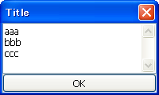
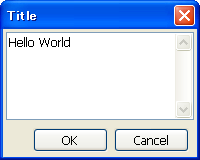
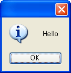

ユーザ入力を取得するダイアログ
----

`Frame` と比べて、`Dialog` は通常モーダルな状態（開いている間、他の `Frame` がユーザ入力を受け付けない状態）でオープンされます。

ダイアログ上でのユーザ入力が終了したら、`Dialog` インスタンスからそれらの入力情報を取得し、その後で明示的に `Dialog` インスタンスを破棄するように実装します。
ダイアログを表示する前に、`Dialog` インスタンスのデータメンバに値をセットしておくようにすれば、その値を使ってダイアログの表示内容を初期化することができます。
`Dialog` インスタンスを破棄するまでは、何度でもダイアログを表示しなおすことができますが、アプリケーションが終了する前には必ず破棄する必要があります。
破棄し忘れると、`MainLoop()` はトップレベルのウィンドウがまだ存在しているとみなし、アプリケーションが終了しません。


ダイアログの基本
----



ダイアログは `wx.Dialog` を継承して作成します。
このサンプルでは、ダイアログにテキストコントロールと、ボタンを配置し、ユーザが入力したテキストを取得しています。

`wx.Frame` にボタンなどを配置する場合は、まず `wx.Panel` を最上位に配置してからその下に配置していくのが一般的ですが、`wx.Dialog` は最初から `wx.Panel` の性質を持っているので、直接ボタンなどのウィジットを配置することができます（直接配置しないと表示がおかしくなるようです）。
`wx.Dialog` に配置した `wx.Button` の `ID` に、`wx.ID_OK` や `wx.ID_CANCEL` を指定すると、ボタンのイベントハンドラが自動的に設定されます。
この場合、ボタンをクリックしたときにダイアログが閉じられ、`Dialog#ShowModal()` の戻り値として、その `ID`（`wx.ID_OK` など）が返されます。

#### 実装例

```python
import wx

class MyDialog(wx.Dialog):
    def __init__(self):
        wx.Dialog.__init__(self, None, -1, 'Title', size=(200,120))

        # Add components.
        self.text = wx.TextCtrl(self, style=wx.TE_MULTILINE)
        button = wx.Button(self, wx.ID_OK, "OK")
        button.SetDefault()

        # Set sizer.
        sizer = wx.BoxSizer(wx.VERTICAL)
        sizer.Add(self.text, 1, wx.EXPAND)
        sizer.Add(button, 0, wx.EXPAND)
        self.SetSizer(sizer)

if __name__ == '__main__':
    app = wx.PySimpleApp()
    dialog = MyDialog()
    result = dialog.ShowModal()
    if result == wx.ID_OK:
        print "Input text =", dialog.text.Label
    else:
        print "Cancel"
    dialog.Destroy()
```

#### 実行例

```
$ python sample.py
Input text = aaa
bbb
ccc
```


ダイアログに配置したボタンの自動レイアウト
----

`wx.StdDialogButtonSizer` を使用すると、ダイアログ上に配置したボタンを一般的なレイアウトで配置してくれます。



このサンプルでは、以下のような構造で `Sizer` を設定しています。

- wx.BoxSizer(wx.VERTICAL)
  - wx.TextCtrl
  - wx.StdDialogButtonSizer
    - wx.Button(wx.ID_OK)
    - wx.Button(wx.ID_CANCEL)

#### 実装例

```python
import wx

class MyDialog(wx.Dialog):
    def __init__(self):
        wx.Dialog.__init__(self, None, -1, 'Title', size=(200,160))
        # Add components.
        self.text = wx.TextCtrl(self, style=wx.TE_MULTILINE)
        btnOk = wx.Button(self, wx.ID_OK)
        btnOk.SetDefault()
        btnCancel = wx.Button(self, wx.ID_CANCEL)

        # Set button sizer.
        btns = wx.StdDialogButtonSizer()
        btns.AddButton(btnOk)
        btns.AddButton(btnCancel)
        btns.Realize()

        # Set main sizer.
        sizer = wx.BoxSizer(wx.VERTICAL)
        sizer.Add(self.text, 1, wx.EXPAND|wx.ALL, 3)
        sizer.Add(btns, 0, wx.EXPAND|wx.ALL, 5)
        self.SetSizer(sizer)

if __name__ == '__main__':
    app = wx.PySimpleApp()
    dialog = MyDialog()
    result = dialog.ShowModal()
    if result == wx.ID_OK:
        print "Input text =", dialog.text.Label
    else:
        print "Cancel"
    dialog.Destroy()
```


定義済みダイアログ
----

### MessageDialog


`wx.MessageDialog` は、ユーザに Yes/No、OK/Cancel などの選択を促すダイアログを提供します。

```python
import wx

if __name__ == '__main__':
    app = wx.PySimpleApp()
    dlg = wx.MessageDialog(None,
        'Choose yes or no.',
        'Message Dialog',
        wx.YES_NO | wx.ICON_QUESTION)
    result = dlg.ShowModal()
    if result == wx.ID_YES:
        print "Yes"
    dlg.Destroy()
```

#### 参考: `wx.MessageDialog.__init__` のヘルプ

```python
wx.MessageDialog(Window parent,
    String message,
    String caption=MessageBoxCaptionStr,
    long style=wxOK|wxCANCEL|wxCENTRE,
    Point pos=DefaultPosition) -> MessageDialog

  Constructor, use ShowModal to display the dialog.
```

ボタンの種類や、アイコンの種類は、`style` パラメータに以下のフラグで指定します。

- アイコンの種類
  - `wx.OK`          -- OK ボタンを表示（ID: `wx.ID_OK`）
  - `wx.CANCEL`      -- Cancel ボタンを表示（ID: `wx.ID_CANCEL`)
  - `wx.YES_NO`      -- YES, NO ボタンを表示 (ID: `wx.ID_YES`, `wx.ID_NO`)
  - `wx.YES_DEFAULT` -- 初期フォーカスを YES ボタンに（デフォルト）
  - `wx.NO_DEFAULT`  -- 初期フォーカスを NO ボタンに

- アイコンの種類
  - `wx.ICON_INFORMATION` -- i
  - `wx.ICON_QUESTION`    -- ?
  - `wx.ICON_EXCLAMATION` -- !
  - `wx.ICON_ERROR`       -- x
  - `wx.ICON_HAND` (= `wx.ICON_ERROR`)

- その他
  - `wx.STAY_ON_TOP` -- 最上位にウィンドウを表示する（別アプリ含む）


MessageBox（MessageDialog のヘルパ）
----



```python
MessageBox(String message, String caption=EmptyString, int style=wxOK|wxCENTRE,
     Window parent=None, int x=-1, int y=-1) -> int
```

単純なメッセージを表示したいだけであれば、`wx.MessageBox()` を使うと便利です。
`wx.MessageBox()` を呼び出すと、内部でダイアログを生成して `ShowModal()` を実行してくれます。

```python
import wx

if __name__ == '__main__':
    app = wx.PySimpleApp()
    wx.MessageBox('Hello')
```


ScrolledMessageDialog
----

`ScrolledMessageDialog` は、`MessageDialog` では収まりきらない長いメッセージを表示するためのダイアログを提供します。

```python
wx.lib.dialogs.ScrolledMessageDialog(parent, msg, caption, pos=wx.wxDefaultPosition,
    size=(500, 300), style=536877056)
```

