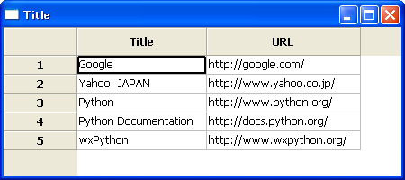

wx.grid.Grid の基本
----



#### 実装例

```python
import wx
import wx.grid

class MyFrame(wx.Frame):
    def __init__(self):
        wx.Frame.__init__(self, None, -1, "Title", size=(450,200))
        self.InitializeComponents()

    def InitializeComponents(self):
        grid = wx.grid.Grid(self)
        grid.CreateGrid(5, 2)

        # Set column labels.
        grid.SetColLabelValue(0, "Title")
        grid.SetColLabelValue(1, "URL")

        # Set cell values.
        grid.SetCellValue(0, 0, "Google")
        grid.SetCellValue(0, 1, "http://google.com/")
        grid.SetCellValue(1, 0, "Yahoo! JAPAN")
        grid.SetCellValue(1, 1, "http://www.yahoo.co.jp/")
        grid.SetCellValue(2, 0, "Python")
        grid.SetCellValue(2, 1, "http://www.python.org/")
        grid.SetCellValue(3, 0, "Python Documentation")
        grid.SetCellValue(3, 1, "http://docs.python.org/")
        grid.SetCellValue(4, 0, "wxPython")
        grid.SetCellValue(4, 1, "http://www.wxpython.org/")

        # Alignment.
        grid.AutoSize()

if __name__ == '__main__':
    app = wx.PySimpleApp()
    MyFrame().Show(True)
    app.MainLoop()
```


Grid の Model と View を分離する
----

`Grid` で扱うデータを表す抽象クラス `wx.grid.PyGridTableBase` を実装すると、`wx.grid.Grid` で扱うモデルとして使用することができます。
このクラスを使用することで、`Grid` の表示部分と、データ部分を分離することが容易になります（MVC モデル）。

`wx.grid.PyGridTableBase`（実際には `wx.grid.GridTableBase`）の以下のメソッドを実装します。

- `GetColLabelValue(self, col)`
  - col 列目のラベルを返すように実装します。
- `GetRowLabelValue(self, row)`
  - row 行目のラベルを返すように実装します。
- `GetNumberCols(self)`
  - 列数を返すように実装します。
- `GetNumberRows(self)`
  - 行数を返すように実装します。
- `IsEmptyCell(self, row, col)`
  - セルの内容が空の場合は True を返すように実装します。
- `GetValue(self, row, col)`
  - row 行 col 列のセルの内容を返すように実装します。
- `SetValue(self, row, col, value)`
  - row 行 col 列へ値を設定するように実装します。読み取り専用にするには pass を記述します。

以下の例では、ソースコード内に記述したデータを `Grid` 用のデータとして使用していますが、さまざまなリソースからデータを読み込むように変更することができます。


```python
import wx
import wx.grid


class MyTable(wx.grid.PyGridTableBase):
    colLabels = ("Title", "URL")

    data = (("Google", "http://google.com/"),
            ("Yahoo! JAPAN", "http://www.yahoo.co.jp/"),
            ("Python", "http://www.python.org/"),
            ("Python Documentation", "http://docs.python.org/"),
            ("wxPython", "http://www.wxpython.org/"))

    def GetColLabelValue(self, col):
        return self.colLabels[col]

    def GetRowLabelValue(self, row):
        return '#' + str(row + 1)

    def GetNumberCols(self):
        return len(self.data[0])

    def GetNumberRows(self):
        return len(self.data)

    def IsEmptyCell(self, row, col):
        return False

    def GetValue(self, row, col):
        return self.data[row][col]

    def SetValue(self, row, col, value):
        pass


class MyFrame(wx.Frame):
    def __init__(self):
        wx.Frame.__init__(self, None, -1, "Title", size=(450,200))
        self.InitializeComponents()

    def InitializeComponents(self):
        grid = wx.grid.Grid(self)

        # Set model.
        grid.SetTable(MyTable())

        # Alignment.
        grid.AutoSize()

if __name__ == '__main__':
    app = wx.PySimpleApp()
    MyFrame().Show(True)
    app.MainLoop()
```

