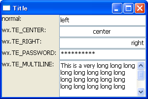
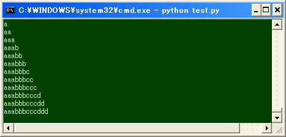

wx.TextCtrl の基本
----

`wx.TextCtrl` は、テキスト入力用のテキストコントロールを提供します。
内部のテキストを中央寄せ、右寄せしたり、パスワード入力用のテキストコントロール、複数行に渡るテキストコントロールを作成することができます。

#### サンプルコード

~~~ python
import wx

class MyFrame(wx.Frame):
    def __init__(self):
        wx.Frame.__init__(self, None, -1, 'Title', size=(300,200))

        # Create widgets.
        panel = wx.Panel(self)
        label1 = wx.StaticText(panel, -1, 'normal:')
        label2 = wx.StaticText(panel, -1, 'wx.TE_CENTER:')
        label3 = wx.StaticText(panel, -1, 'wx.TE_RIGHT:')
        label4 = wx.StaticText(panel, -1, 'wx.TE_PASSWORD:')
        label5 = wx.StaticText(panel, -1, 'wx.TE_MULTILINE:')
        text1 = wx.TextCtrl(panel)
        text2 = wx.TextCtrl(panel, style=wx.TE_CENTER)
        text3 = wx.TextCtrl(panel, style=wx.TE_RIGHT)
        text4 = wx.TextCtrl(panel, style=wx.TE_PASSWORD)
        text5 = wx.TextCtrl(panel, style=wx.TE_MULTILINE)

        # Set sizer.
        sizer = wx.FlexGridSizer(cols=2, vgap=1, hgap=5)
        sizer.Add(label1)
        sizer.Add(text1, flag=wx.EXPAND)
        sizer.Add(label2)
        sizer.Add(text2, flag=wx.EXPAND)
        sizer.Add(label3)
        sizer.Add(text3, flag=wx.EXPAND)
        sizer.Add(label4)
        sizer.Add(text4, flag=wx.EXPAND)
        sizer.Add(label5)
        sizer.Add(text5, flag=wx.EXPAND)
        sizer.AddGrowableCol(1)
        sizer.AddGrowableRow(4)
        panel.SetSizer(sizer)

if __name__ == '__main__':
    app = wx.PySimpleApp()
    MyFrame().Show(True)
    app.MainLoop()
~~~

テキストの内容が変わったときのイベント
----

`wx.TextCtrl` のテキストの内容が変わったことを知りたい場合は、`wx.EVT_TEXT` イベントをハンドルするようにします。
次の例では、テキストの内容が変わるごとに、現在の内容をコンソールへ出力しています。

#### サンプルコード

~~~ python
import wx

class MyFrame(wx.Frame):
    def __init__(self):
        wx.Frame.__init__(self, None, -1, 'Title')

        # Create widgets.
        self.text1 = wx.TextCtrl(self, size=(200,-1))
        self.text1.Bind(wx.EVT_TEXT, self.OnText)
        self.Fit()

    def OnText(self, event):
        print self.text1.GetValue()

if __name__ == '__main__':
    app = wx.PySimpleApp()
    MyFrame().Show(True)
    app.MainLoop()
~~~

Enter キーの入力を取得する
----

`wx.TextCtrl` のコンストラクタで、`style` パラメータに `wx.TE_PROCESS_ENTER` を指定しておくと、Enter キーを入力したときに `wx.EVT_TEXT_ENTER` イベントが発生するようになります。
次の例では、テキストコントロール内で Enter キーを入力したときに、その入力内容をコンソールに出力しています。

#### サンプルコード

~~~ python
import wx

class MyFrame(wx.Frame):
    def __init__(self):
        wx.Frame.__init__(self, None, -1, 'Title')

        # Create widgets.
        self.text1 = wx.TextCtrl(self, size=(200,-1), style=wx.TE_PROCESS_ENTER)
        self.text1.Bind(wx.EVT_TEXT_ENTER, self.OnTextEnter)
        self.Fit()

    def OnTextEnter(self, event):
        print self.text1.GetValue()

if __name__ == '__main__':
    app = wx.PySimpleApp()
    MyFrame().Show(True)
    app.MainLoop()
~~~

入力可能なテキストの長さを制限する
----

`wx.TextCtrl` 内に入力できるテキストの文字数を制限したいときは、下記のメソッドを使用します。

~~~ python
wx.TextCtrl#SetMaxLength(self, unsigned long len)
~~~

設定したサイズを越えてテキストを入力しようとした場合は、`wx.EVT_TEXT_MAXLEN` イベントが発生します。
次の例では、入力できるテキストサイズを 10 文字に制限しています（日本語も ASCII 文字同様に、1 文字と数えるようです）。

#### サンプルコード

~~~ python
import wx

class MyFrame(wx.Frame):
    def __init__(self):
        wx.Frame.__init__(self, None, -1, 'Title')

        # Create widgets.
        self.text1 = wx.TextCtrl(self, size=(200,-1))
        self.text1.SetMaxLength(10)
        self.text1.Bind(wx.EVT_TEXT_MAXLEN, self.OnTextMaxLen)
        self.Fit()

    def OnTextMaxLen(self, event):
        print 'Too long.'

if __name__ == '__main__':
    app = wx.PySimpleApp()
    MyFrame().Show(True)
    app.MainLoop()
~~~

