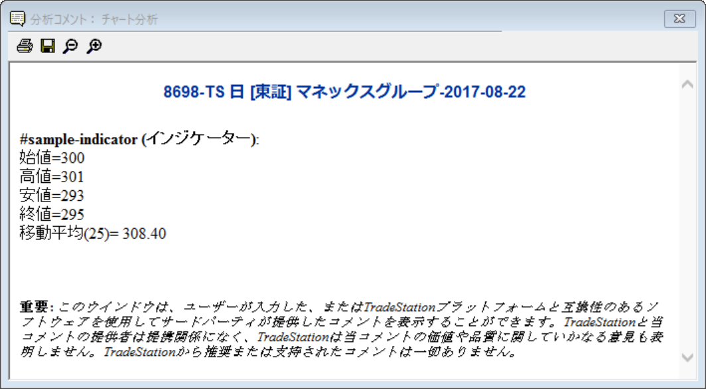

{: .center}

`Commentary` 関数によって各バーに設定しておいた注釈テキストは、下記のようにして**分析コメントウィンドウ (AnalysisCommentary Window)**に表示することができます。

1. メニューから「表示(V)」→「分析コメント(Y)」を選択
2. チャート上の任意のバーをクリック

一度分析コメントウィンドウを開いたら、左右キーを使って、隣のバーの注釈コメントを見ていくことができます。

`Commentary` 関数は、１つのバーを処理中に何度も呼び出すことができ、その場合は渡したテキストが結合されて分析コメントウィンドウに表示されます。
改行を入れるには、下記のように `NewLine` キーワードを組み合わせて使用します。

~~~
Commentary("始値=", Open:0:0, NewLine);
Commentary("高値=", High:0:0, NewLine);
Commentary("安値=", Low:0:0, NewLine);
Commentary("終値=", Close:0:0, NewLine);
Commentary("移動平均(25)=", Average(Close, 25), NewLine);
~~~

実は、`Commentary` の派生関数の `CommentaryCL` を使用すると、末尾に自動的に改行を入れていくれるので、上記のコードは下記のように記述することもできます。

~~~
CommentaryCL("始値=", Open:0:0);
CommentaryCL("高値=", High:0:0);
CommentaryCL("安値=", Low:0:0);
CommentaryCL("終値=", Close:0:0);
CommentaryCL("移動平均(25)=", Average(Close, 25));
~~~

分析コメントウィンドウは、HTML ページとして構成されているため、下記のように HTML タグを入れてテキストを装飾することができます。

~~~
CommentaryCL("<b>四本値</b>");
CommentaryCL("始値=", Open:0:0);
CommentaryCL("高値=", High:0:0);
CommentaryCL("安値=", Low:0:0);
CommentaryCL("終値=", Close:0:0);
~~~

