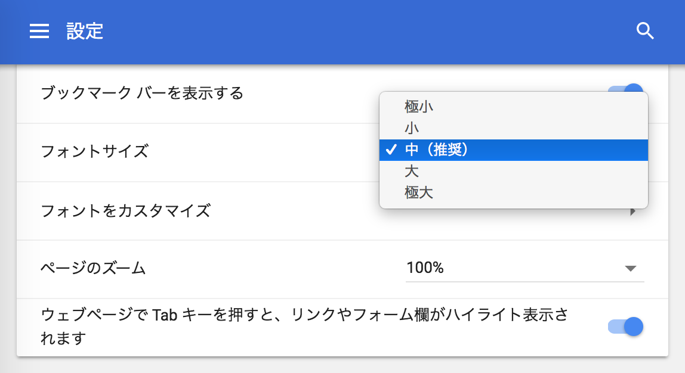

固定のフォントサイズを指定する方法
----

まずは、よくない方法からです。

~~~ css
html {
  font-size: 12pt;
}
~~~

このような具体的な値でフォントサイズを指定してしまうと、ウェブブラウザの設定でユーザが指定したフォントサイズを無視したサイズで描画されてしまうことになります。

#### 表示デモ１（よくない例）

<iframe class="xHtmlDemo" src="font-size-demo1.html"></iframe>
<a target="_blank" href="font-size-demo1.html">デモページ１を開く</a>

例えば、Chrome の設定画面では、下記のようなフォントサイズ設定がありますが、上記のようなフォントサイズ指定を行ってしまうと、ここでユーザが設定した値が無視されてしまいます。

{: .center }

これは、ユーザビリティを考慮したデザインとは言えません。

フォントサイズを 100% で指定する方法
----

次に、望ましいフォントサイズの設定方法です。

~~~ css
html {
  font-size: 100%;
}
~~~

このように、パーセンテージ指定でフォントサイズを指定しておくと、ブラウザのデフォルトのフォントサイズ（通常は 16px = 12pt）や、ユーザが設定したフォントサイズが正しく反映されて描画されるようになります。

#### 表示デモ２（よい例）

<iframe class="xHtmlDemo" src="font-size-demo2.html"></iframe>
<a target="_blank" href="font-size-demo2.html">デモページ２を開く</a>

ブラウザのフォントサイズ設定を変更した時に、上記のデモページのフォントサイズが変更されることを確認してみてください。

残りの要素に関しては、`rem` や `em` などの単位を使用してレイアウトすることで、サイト全体がユーザのフォントサイズ設定に連動して拡大縮小されて表示されるようになります。

~~~ css
p {
  margin: 1.5rem 0;
  font-size: 1rem;
  line-height: 1.5;
}
~~~

