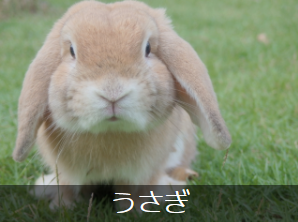

４つの position 指定
----

position: static;
: 何も指定しない場合の初期値です。デフォルトの表示ルールによって要素が配置されます。あえて明示的に指定することはおそらくありません。

position: fixed;
: 画面上の指定した位置に固定配置します。スクロールしても表示位置の変わらないサイトヘッダーや、SNS ボタン群の表示などに利用することができます。

position: relative;
: 本来表示される位置から相対的に位置をずらします。補助的な使用方法として、自分自身の `z-index` プロパティを指定する場合や、子要素に `position: absolute;` を指定する場合にも使用されます。

position: absolute;
: 親要素の位置を基準にした絶対位置で配置します。`position: absolute;` を指定するには、その親要素に `position: relative;`（あるいは `fixed`、`absolute`）を指定しておく必要があります（親要素を移動させる必要がないときは、単純に `position: relative;` とだけ記述しておけば OK）。

position: fixed
----

{: .center }

<a target="_blank" href="position-fixed.html">デモページを開く</a>

`position: fixed;` を指定すると、ブラウザの表示領域内でどの位置に表示するかを指定することができます。
具体的な表示位置は、`top`、`bottom`、`left`、`right` プロパティで指定します。
例えば、`top: 0px; left: 0px;` という指定を行えば、その要素はブラウザの画面上の左上に固定表示され、ユーザが画面スクロールを行ってもその要素は移動しません。
例えば、上記の<a target="_blank" href="position-fixed.html">デモページ</a>で表示しているように、サイトのヘッダ情報を画面上部に固定表示したり、サイドバーのメニューを固定表示したりするのに利用することができます。

position: relative
----

{: .center }

<a target="_blank" href="position-relative.html">デモページを開く</a>

`position: relative;` を指定すると、本来その要素が表示されるはずだった位置からのオフセットを指定して、表示位置をずらすことができます。
要素の表示位置をずらしたとしても、**後続の要素は、その位置ずらしがなかったものとして配置される**ことに注意してください。上記の<a target="_blank" href="position-relative.html">デモページ</a>の表示を見るとよくわかると思います。

ちなみに、`position: relative;` の指定をだけを行い、`top`、`bottom`、`left`、`right` の指定を行わなかった場合は、その要素は本来表示されるべき位置にそのまま表示されます。
このような一見無駄に見える指定は、`z-index` プロパティ（要素の重なりの順序）を指定する際によく行われます。
なぜなら、`z-index` プロパティの指定は、`position` プロパティがデフォルトの `static` 値のままだと効果を発揮しないからです。
下記の例では、`z-index` プロパティの指定を有効にする目的のために `position: relative;` を指定しています。

~~~ css
.sample {
  position: relative;  /* z-index の有効化のため（座標値は変わらない） */
  z-index: 100;        /* 要素同士の重なり順序を指定（上の方に表示） */
}
~~~

また同様に、後述の `position: absolute;` という指定を有効にするためにも、親要素の `position` 指定を行う必要があります。
この場合も、`position` プロパティの値としては `fixed`、`relative`、`absolute` のいずれでも構わないのですが、表示位置に影響のない `position: relative;` という指定がよく使われます。

position: absolute
----

{: .center }

<a target="_blank" href="position-absolute.html">デモページを開く</a>

`position: absolute;` を使用すると、その親要素を基準とした絶対位置で表示位置を指定することができます（感覚的には絶対位置というよりは相対位置ですが）。
注意しなければいけないのは、親要素の `position` プロパティとして、`fixed`、`relative`、`absolute` のいずれかを指定しておく必要があるというところです（つまり、デフォルトの `static` のままだと NG）。
親要素の表示位置を特に移動させる必要がない場合は、親要素で `position: relative;` とだけ指定しておくのがよいでしょう。

例えば、下記のようにすると、親要素 (`.parent`) の左上に重なる形で、子要素 (`.child`) が表示されます。

~~~ css
.parent {
  position: relative;
}

.child {
  position: absolute;
  top: 0px;
  left: 0px;
}
~~~

`position: absolute;` は、画像の上にタイトル表示を重ねる場合などによく使用されます。
下記の例では、うさぎの画像に、「うさぎ」というテキストを重ねて表示しています。

{: .center }

#### HTML 抜粋

~~~ html
<figure class="catalog">
  
  <figcaption>うさぎ</figcaption>
</figure>
~~~

#### CSS 抜粋

~~~ css
.catalog {
  position: relative;  /* 子要素で position: absolute; を使うため */
  max-width: 300px;
}
.catalog img {
  width: 100%;
  vertical-align: bottom;  /* これ入れないとテキストの位置が微妙に下にずれる */
}
.catalog figcaption {
  position: absolute;  /* 親要素の位置を基準に表示位置を指定する */
  bottom: 0px;
  left: 0px;
  width: 100%;
  text-align: center;
  font-size: 20pt;
  color: white;
  background: rgba(0, 0, 0, 0.5);
}
~~~

ちなみに、`top`、`bottom`、`left`、`right` などのプロパティにマイナスの値を指定すると、親要素からその分だけはみ出した位置に子要素を表示させることができます。
うまく配置すれば、画像を隠さないようにキャプションを表示することができます。

