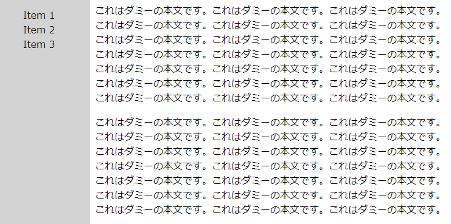

画面の高さいっぱいに表示する (height: 100vh)
----

{: .center }

<a target="_blank" href="full-height-menu-sample1.html">デモページを表示する</a>

HTML 要素のスタイルに `height: 100vh;` と指定すると、画面の高さいっぱいにその要素を表示することができます。

#### HTML 抜粋

~~~ html
<main>
  

    これはダミーの本文です。これはダミーの本文です。これはダミーの本文です。
    ...
  

</main>

<nav class="menu">
  <ul>
    <li>Item 1
    <li>Item 2
    <li>Item 3
  </ul>
</nav>
~~~

#### CSS 抜粋

~~~ css
main {
  display: block;
  margin-left: 150px;
}
.menu {
  position: fixed;
  top: 0px;
  left: 0px;
  width: 150px;
  height: 100vh;
  background: lightgray;
}
.menu li {
  list-style: none;
}
~~~

`vh` は Viewpoint Height の略で、上記のように `100vh` と指定すると、画面の高さとちょうど同じ (100%) という意味になります。
`50vh` とすれば、画面の高さの半分になります。

要素の表示方法が <code>display: inline;</code> となっている要素（例えば <code>b</code> 要素など）は、<code>width</code> や <code>height</code> プロパティによる表示サイズ指定は行えません。
これらのプロパティは、<code>display: block;</code> や <code>display: inline-block;</code> となっている要素に有効です。

親要素の高さいっぱいに表示する (height: 100%)
----

{: .center }

<a target="_blank" href="full-height-menu-sample2.html">デモページを表示する</a>

ある要素を「画面の高さ」いっぱいに表示するのではなく、「親要素の高さ」いっぱいに表示するには、`height` プロパティの値を `100vh` とするのではなく、`100%` とパーセンテージで指定します。
パーセンテージ指定は親要素を基準としたサイズ指定となるので、親要素の `height` が正しく設定されていることに注意してください。

#### HTML 抜粋

~~~ html

  親要素 (.parent)
  
子要素 (.child)

  親要素 (.parent) の続き

~~~

#### CSS

~~~ css
.parent {
  display: block;
  height: 150px;
  background: #acf;
}
.child {
  display: inline-block;
  height: 100%;
  background: #fac;
}
~~~

